# <center>Programming Chat App </center>

## <center>Proyecto final de Grado DAM</center>

#### <center>Autor: Emilio Orduña Peña</center>

## Aplicación Web Chat App

## Índice

1. [Introducción](#introducción)
2. [Motivación para la Realización del Proyecto](#motivación-para-la-realización-del-proyecto)
3. [Descripción del Proyecto](#descripción-del-proyecto)
4. [Objetivos](#objetivos)
5. [Beneficios y Valor Agregado](#beneficios-y-valor-agregado)
6. [Funcionalidades del Proyecto y Tecnologías Utilizadas](#funcionalidades-del-proyecto-y-tecnologías-utilizadas)
7. [Guía de Instalación](#guía-de-instalación)
8. [Guía de Uso](#guía-de-uso)
9. [Enlace a la Documentación](#enlace-a-la-documentación)
10. [Enlace a Figma de la Interfaz](#enlace-a-figma-de-la-interfaz)
11. [Conclusión](#conclusión)
12. [Contribuciones y Agradecimientos](#contribuciones-y-agradecimientos)
13. [Referencias](#referencias)
14. [Licencias](#licencias)
15. [Contacto](#contacto)

## Introducción

El "Programming Chat App" es una aplicación de chat desarrollada para optimizar la comunicación entre clientes y administradores. Esta herramienta permite el intercambio de mensajes de manera eficiente y segura, proporcionando una experiencia de chat fluida y efectiva. Está diseñada tanto para completar el proceso postcompra de la personalización de productos específicos, como para servir de soporte en caso de cualquier incidente relacionado con los mismos.

### Motivacion

El impulso para embarcarme en este proyecto se origina en mi profunda convicción de la importancia de la digitalización y la mejora de los procesos empresariales, especialmente en el contexto de los comercios locales. He sido testigo directo de cómo la falta de digitalización puede limitar el crecimiento y la eficiencia de estos negocios, obstaculizando su capacidad para competir en un mercado cada vez más digitalizado y exigente.

La idea de desarrollar esta iniciativa surge de años de observación y estudios del sector empresarial local por parte de universidades y centros, donde se evidencia la necesidad de adoptar soluciones tecnológicas innovadoras para optimizar la operatividad y mejorar la experiencia tanto de los propietarios como de los clientes. Mi motivación radica en identificar y abordar desafíos específicos que afectan directamente el desempeño y la satisfacción en un determinado ámbito.

En este contexto, la digitalización de empresas o comercios locales se presenta como una oportunidad para optimizar procesos, mejorar la atención al cliente y aumentar la competitividad en un mercado en constante evolución. Al proporcionar soluciones tecnológicas adaptadas a las necesidades y características de estos negocios, se busca facilitar su adaptación a un entorno digital, brindando herramientas que les permitan competir de manera más efectiva y alcanzar un mayor nivel de éxito.

La creación de esta aplicación móvil está impulsada por la firme convicción de que la tecnología puede ser un catalizador para el crecimiento y la innovación en el sector empresarial local. Al facilitar la comunicación y la interacción entre clientes y propietarios, se busca transformar la manera en que se llevan a cabo las operaciones comerciales y se gestionan las relaciones con los clientes, promoviendo un entorno más eficiente, conectado y centrado en el cliente.

En resumen, mi motivación para llevar a cabo este proyecto radica en el firme compromiso de contribuir al avance y la mejora de los negocios locales a través de la implementación de soluciones tecnológicas innovadoras. Al aprovechar el potencial de la digitalización, se busca no solo resolver problemas prácticos y mejorar la eficiencia operativa, sino también impulsar el crecimiento y la competitividad de estos negocios en un mundo cada vez más digitalizado y competitivo.

### Descripcion

El proyecto se despliega en dos componentes principales:

1. **Backend:**

   - **API con FastAPI:** Opté por FastAPI para el desarrollo del backend debido a su rapidez, facilidad de uso y alto rendimiento. FastAPI es un marco web moderno y eficiente para la creación de APIs en Python. Su capacidad para gestionar operaciones CRUD de forma rápida y segura lo convierte en la opción ideal para manejar las operaciones de usuarios, mensajes y chats en nuestro sistema.
   - **Microservicio de Mensajería Instantánea con Express y Socket.io:** Para la implementación del servicio de mensajería instantánea, elegí Express.js y Socket.io. Express.js proporciona un entorno robusto para construir aplicaciones web y APIs en Node.js, mientras que Socket.io facilita la comunicación en tiempo real entre clientes y servidores a través de WebSockets. Esta combinación nos permite ofrecer una experiencia de chat fluida y en tiempo real para nuestros usuarios.

2. **Frontend:**
   - **Desarrollo con Angular:** Angular fue la elección para el desarrollo del frontend debido a su estructura modular, su enfoque en la creación de aplicaciones de una sola página (SPA) y su sólido sistema de componentes. Estas características garantizan una interfaz de usuario dinámica y altamente interactiva. La estructura de Angular permite a los clientes acceder y realizar diversas acciones de manera intuitiva, mientras que los administradores tienen acceso a funciones adicionales para gestionar eficientemente las operaciones del sistema.

**Descripción del Proyecto:**
El proyecto se concibe con el objetivo de digitalizar y mejorar la eficiencia de empresas y comercios locales, ofreciendo una solución integral para la comunicación y gestión de clientes. La decisión de utilizar las herramientas mencionadas se basa en la búsqueda de una solución robusta, escalable y fácil de usar.

En el backend, FastAPI y Express.js proporcionan una base sólida para la creación de APIs y servicios de mensajería instantánea, respectivamente. Estas tecnologías permiten gestionar eficazmente las operaciones CRUD, garantizando un rendimiento óptimo y una comunicación en tiempo real entre usuarios.

Por otro lado, Angular en el frontend garantiza una experiencia de usuario moderna y atractiva, con una interfaz intuitiva y fácil de navegar. Los clientes pueden acceder y utilizar diversas funcionalidades de forma sencilla, mientras que los administradores tienen acceso a herramientas adicionales para administrar eficientemente las operaciones del sistema.

En resumen, el proyecto busca transformar la manera en que las empresas locales interactúan con sus clientes, ofreciendo una solución tecnológica innovadora que mejora la comunicación, optimiza los procesos y promueve el crecimiento y la competitividad en un entorno empresarial cada vez más digitalizado.

### Objetivos

1. **Digitalización de Empresas Locales:** Modernizar la interacción de las empresas locales con sus clientes mediante tecnología avanzada, creando un entorno más digital y eficiente.
2. **Mejora de la Eficiencia Operativa:** Optimizar los procesos internos y externos para agilizar la comunicación y gestión de recursos, aumentando la productividad y reduciendo costos.
3. **Facilitar la Comunicación:** Crear una plataforma digital que facilite y mejore la comunicación entre clientes y administradores, garantizando una experiencia de usuario fluida.

4. **Ofrecer una Experiencia de Usuario Mejorada:** Desarrollar una interfaz intuitiva y accesible para clientes y administradores, asegurando una experiencia positiva y fácil de usar.

5. **Promover la Competitividad Empresarial:** Equipar a las empresas locales con herramientas tecnológicas que les permitan adaptarse rápidamente a las demandas del mercado y superar a sus competidores.

### Beneficios y Valor Agregado

1. **Optimización de Procesos:** La digitalización permitirá una gestión más eficiente de las operaciones, reduciendo los tiempos de respuesta y optimizando el uso de recursos.

2. **Mayor Satisfacción del Cliente:** Una mejor experiencia de usuario y una comunicación más efectiva aumentarán la satisfacción y fidelización de los clientes, lo que se reflejará en mayores ventas y retención.

3. **Mejora de la Competitividad:** Las empresas locales que adopten estas soluciones tecnológicas estarán mejor posicionadas para competir en un mercado digitalizado, aumentando su cuota de mercado y destacándose frente a la competencia.

4. **Impulso al Desarrollo Económico Local:** La implementación de tecnología innovadora en los negocios locales tendrá un impacto positivo en la economía de la comunidad, generando nuevas oportunidades de empleo y fomentando el crecimiento empresarial.

5. **Conectividad y Colaboración:** Facilitar una mejor comunicación entre clientes y administradores promoverá un entorno más conectado y colaborativo, mejorando las relaciones comerciales y la gestión de clientes.

## Funcionalidades del Proyecto y Tecnologías Utilizadas

### Funcionalidades:

- Chat en tiempo real entre cliente y administrador.
- Interfaz intuitiva y fácil de usar.
- Toma de datos para la personalización a través de un formulario.
- Registro y seguimiento de clientes.
- Control del estado de productos y chats.
- Agregar y eliminar chats.
- Cambiar la contraseña.

### Tecnologías Utilizadas:

- **Front-end**:

  - HTML, CSS, Angular, TypeScript.

- **Back-end**:
  - **Microservicio de mensajería instantánea**:
    - Implementado con la librería socket.io y Express.js utilizando JavaScript.
  - **Microservicio de API**:
    - Desarrollado con FastAPI en Python, encargado de las operaciones CRUD de usuarios, chats y mensajes.

## Guía de Instalación

Desde el punto de vista del desarrollador que desea descargar y personalizar el proyecto desde GitHub, los pasos a seguir serian los siguientes:

### Requisitos previos

1. Primero tenemos que tener instalado en el sistema:
   - Python 3.x
   - Node.js y npm (o yarn)
   - Git

#### Backend (FastAPI)

1. Clonar el repositorio "processing-chat-fastapi":

   ```
   git clone https://github.com/emilio0p/processing-chat-fastapi.git
   ```

2. Acceder a la carpeta del backend:

   ```
   cd processing-chat-fastapi
   ```

3. Crear y activar un entorno virtual de Python:

   ```
   python -m venv venv
   source venv/bin/activate
   ```

4. Instalar las dependencias del backend:

   ```
   pip install -r requirements.txt
   ```

5. Configurar las variables de entorno necesarias, como la conexión a la base de datos y las claves de autenticación.

6. Iniciar el servidor FastAPI:
   ```
   uvicorn main:app --reload
   ```

#### Frontend (Angular)

1. Clonar el repositorio "processing-chat-angular":

   ```
   git clone https://github.com/emilio0p/processing-chat-angular.git
   ```

2. Acceder a la carpeta del frontend:

   ```
   cd processing-chat-angular
   ```

3. Instalar las dependencias del frontend:

   ```
   npm install
   ```

4. Configurar las variables de entorno necesarias, como la URL de la API del backend.

5. Iniciar el servidor de desarrollo de Angular:
   ```
   ng serve
   ```

### Acceder a la Aplicación

1. Abre tu navegador web y visita `http://localhost:4200` para acceder a la aplicación.

## Guía de Uso

### Para Administradores:

#### Instrucciones

1. ##### **Abrir la Aplicación en tu Navegador:**

   Abre tu navegador web preferido e introduce la dirección URL: https://processingchatapp.azurewebsites.net/auth/login

2. ##### **Iniciar Sesión:**

   Una vez que la aplicación se cargue, serás redirigido a la página de inicio de sesión. Introduce tus credenciales de administrador y haz clic en el botón de inicio de sesión para acceder a tu cuenta.

3. ##### **Una vez dentro de la aplicación, podrás:**

   - Revisar los Chats Abiertos.
   - Cambiar el estado de los chats.
   - Intercambiar mensajes con los usuarios.
   - Buscar a través de la barra de búsqueda.
   - Agregar un usuario mediante su email, nombre y número de teléfono.
     - Al registrarlo, se le enviará automáticamente un correo electrónico que podría encontrarse en spam o no deseado.
   - Añadir un chat, ya sea con un usuario nuevo (primero agregarlo) o existente, mediante su correo electrónico, eligiendo el tipo de producto y la fecha de entrega del mismo.
   - Eliminar un chat
   - Cambiar la contraseña.

4. ##### **Cerrar Sesión**

#### Capturas de Pantalla

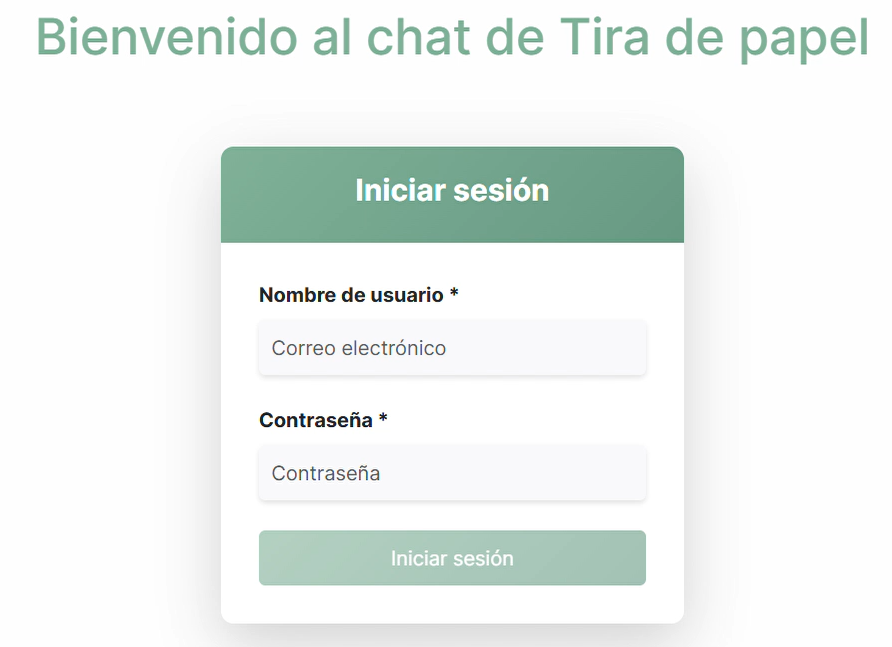

_Aquí se escribe el email y la contraseña de usuario._

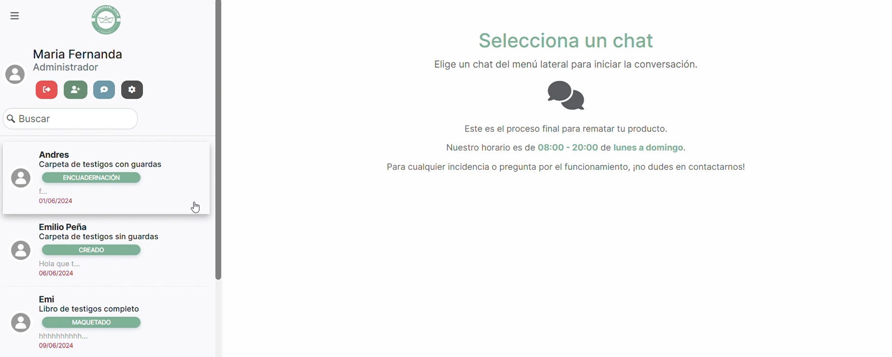

_Pantalla de incio del lado de administrador._

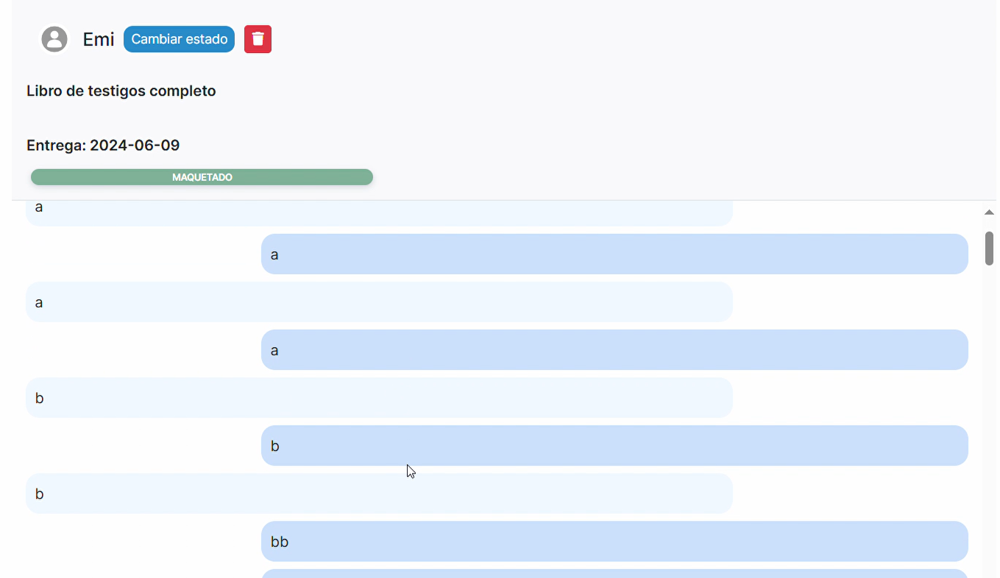

_Vemos el chat seleccionado._

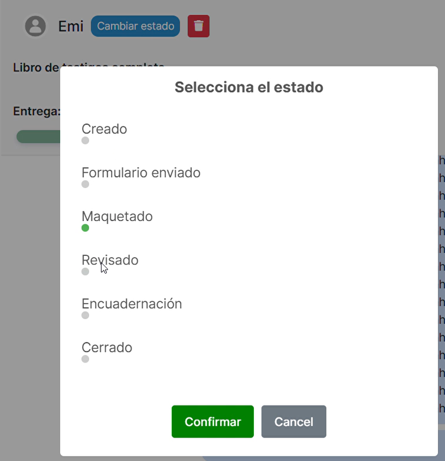

_Aqui podemos cambiar el estado del chat según esté el pedido._

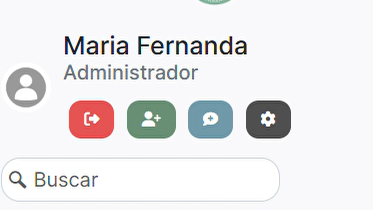

_Aqui podemos buscar chat, cerrar sesión, añadir cliente, añadir chat y cambiar la contraseña._

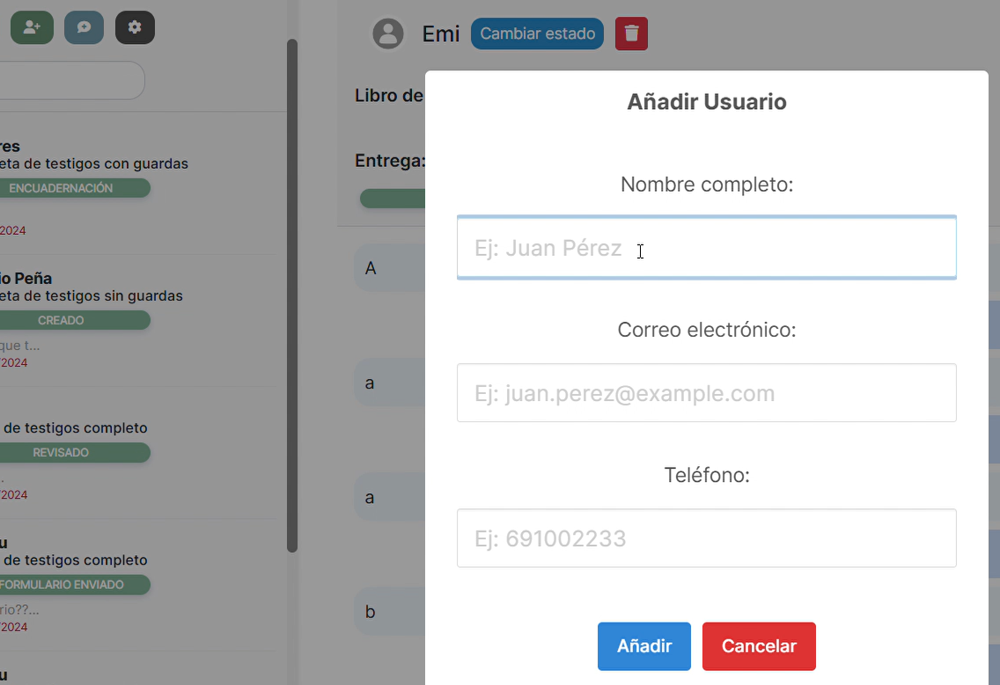

_Haciendo click sobre el botón verde, podemos añadir un usuario con su nombre, correo electrónico y número de teléfono._

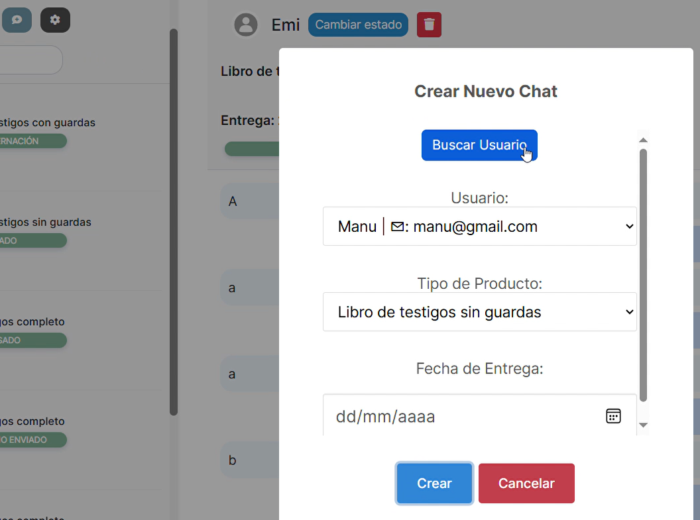

_Haciendo click sobre el botón gris, podemos añadir un chat buscando un usuario por su email, añadiendo el tipo de producto y la fecha de entrega._

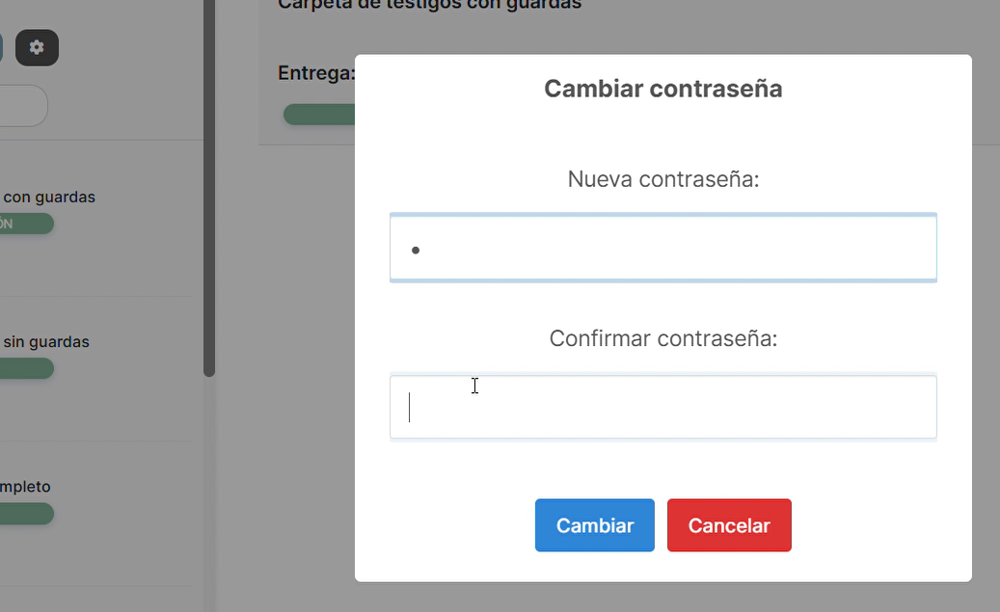

_Haciendo click sobre el botón gris oscuro, podemos cambiar la contraseña._

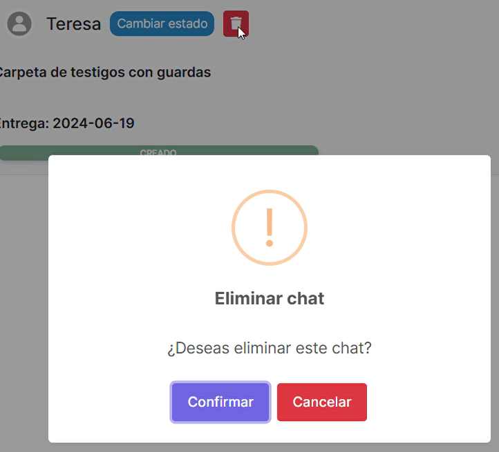

_Haciendo click sobre el botón rojo, podemos eliminar el chat._

### Para Clientes:

#### Instrucciones

1. ##### **Abrir la Aplicación en tu Navegador:**

   Abre tu navegador web preferido e introduce la dirección URL: https://processingchatapp.azurewebsites.net/auth/login

2. ##### **Iniciar Sesión:**

   El administrador te habrá enviado un correo que podría estar en spam o correo no deseado, con tu usuario y contraseña para iniciar sesión.

3. ##### **Una vez dentro de la aplicación, podrás:**

   - Comenzar a chatear.
   - Ver todos los chats disponibles según los productos que hayas comprado y mantener una conversación en tiempo real con el administrador.
   - Si aún no has rellenado el formulario detallando tu pedido, verás un botón en la parte superior derecha para hacerlo. Una vez rellenado, y al volver a la página anterior, se te pedirá que confirmes si has completado el formulario.
   - Cambiar la contraseña.

4. ##### **Cerrar Sesión**

#### Capturas de Pantalla


_Aquí se escribe el email y la contraseña de usuario._

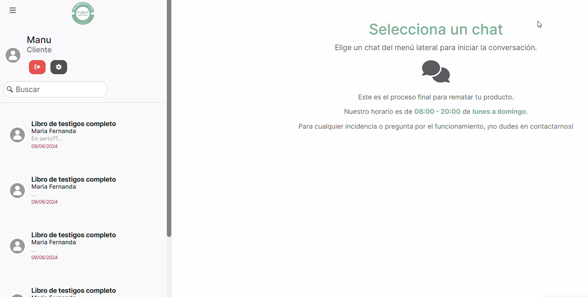

_Pantalla de incio del lado de cliente._

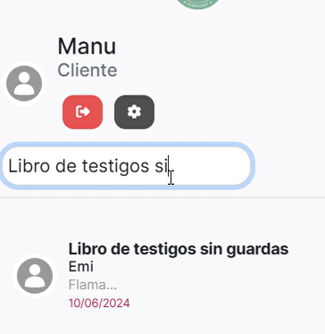

_Buscamos chat._

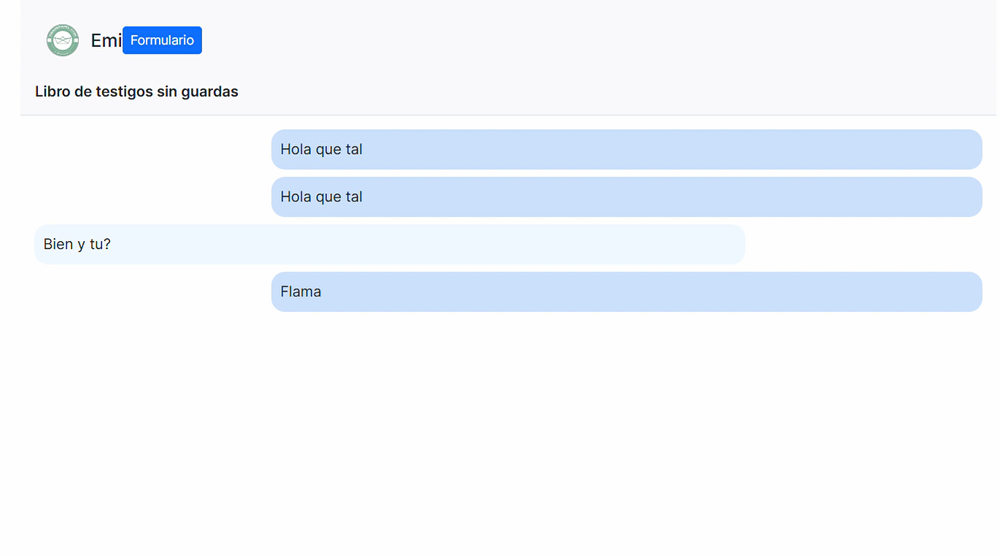

_Aquí podemos ver el chat seleccionado._

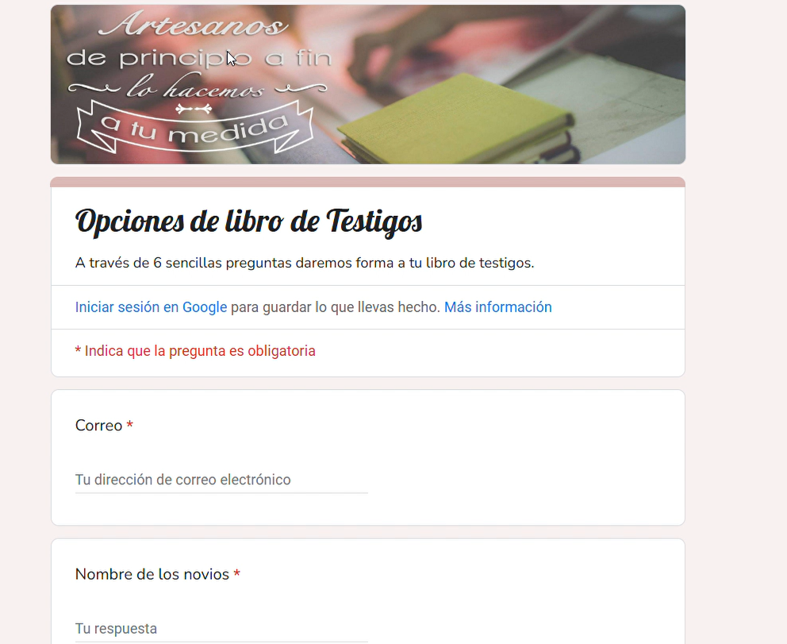

_Aquí tras darle al botón de formulario, rellenamos el formulario._

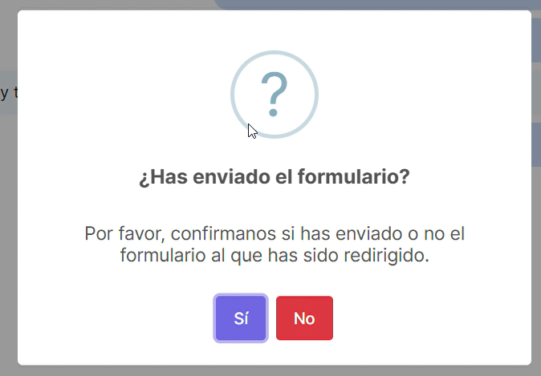

_Tras rellenar el formulario, hay que confirmarlo._

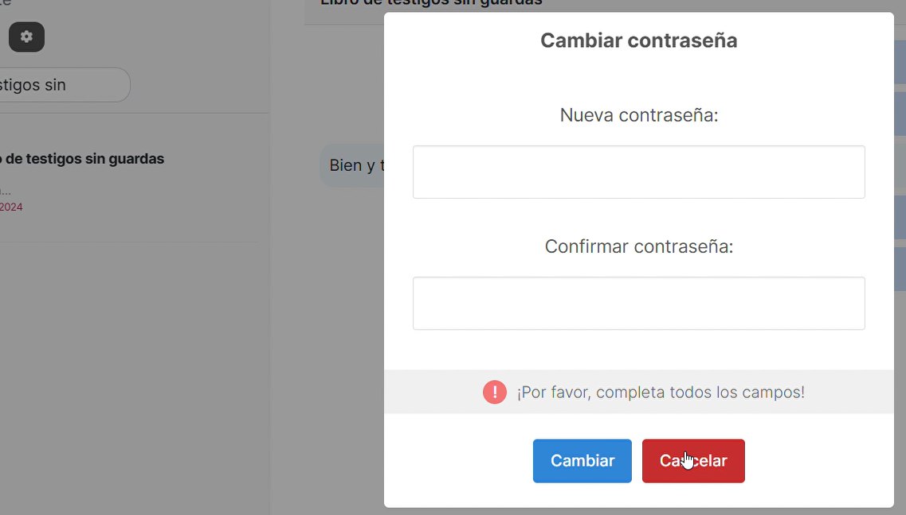

_Haciendo click sobre el botón gris oscuro, podemos cambiar la contraseña._

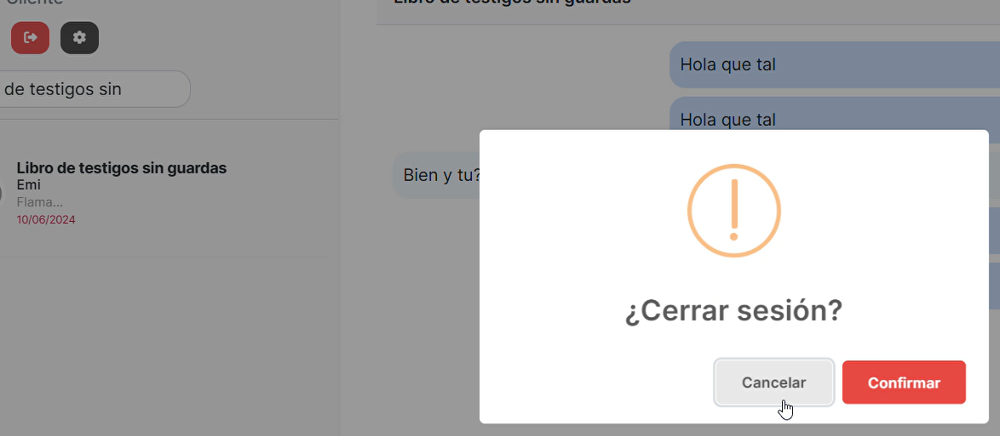

_Haciendo click sobre el botón rojo, cerramos la sesión del cliente._

## Enlace a la Documentación

https://emilio0p.github.io/processingchatapp-docs/

## Enlace a Figma de la Interfaz

https://www.figma.com/design/UxxLIk0mL3kuOLOXkXy6Wi/CHAT_TFG?node-id=0-1&t=bUYcETxCWEowFckg-1

## Conclusión

El "Programming Chat App" es una herramienta crucial para potenciar la comunicación instantánea entre clientes y administradores. Su interfaz fácil de usar y su enfoque intuitivo mejoran la experiencia del usuario y la gestión de consultas, impulsando la satisfacción del cliente y la competitividad empresarial local.

Además de resolver necesidades prácticas, este proyecto impulsa la innovación tecnológica y la digitalización de negocios locales. Al ofrecer herramientas avanzadas, no solo mejora la eficiencia operativa, sino que también contribuye al crecimiento económico, generando empleo y atrayendo inversiones.

En resumen, el "Programming Chat App" es un paso fundamental hacia la digitalización y la mejora de los procesos empresariales locales. Su implementación no solo beneficia a los negocios locales, sino que también fortalece la comunidad al promover un entorno más conectado y centrado en el cliente.

## Contribuciones y Agradecimientos

Quiero expresar mi sincero agradecimiento a todas las personas que han contribuido y apoyado en la realización de este proyecto TFG.

Agradezco a mis profesores por su orientación, apoyo y conocimientos compartidos a lo largo de este proceso académico. Quiero agradecer a mis compañeros por su colaboración, intercambio de ideas y motivación mutua durante el desarrollo de este proyecto. Un agradecimiento especial a mis padres por su inquebrantable apoyo, comprensión y aliento en cada paso de mi camino académico. Dedico un agradecimiento especial a Teresa, cuya aportación ha sido fundamental para el éxito y la calidad de este trabajo. Y otro especial agradecimiento a Maria Fernanda por la idea y ayuda durante todo el proyecto.

Estoy profundamente agradecido por el apoyo brindado por todas estas personas, cuyo compromiso y ayuda han sido vitales en la culminación de este proyecto de Trabajo de Fin de Grado. ¡Gracias a todos por ser parte de este viaje!

## Referencias

1. **Angular y TypeScript**

   - Angular Documentation: https://angular.io/docs
   - TypeScript Documentation: https://www.typescriptlang.org/docs/
   - Pro Angular (Apress, Adam Freeman): https://www.apress.com/gp/book/9781484244470
   - Angular Projects (Packt Publishing): https://www.packtpub.com/product/angular-projects/9781789951995

2. **CSS**

   - MDN Web Docs (CSS): https://developer.mozilla.org/en-US/docs/Web/CSS
   - CSS-Tricks: https://css-tricks.com/
   - CSS: The Definitive Guide (O'Reilly Media): https://www.oreilly.com/library/view/css-the-definitive/9781449325053/
   - A Complete Guide to Flexbox: https://css-tricks.com/snippets/css/a-guide-to-flexbox/

3. **Microservicios de Mensajería Instantánea con Socket.io y Express.js**

   - Socket.io Documentation: https://socket.io/docs/
   - Express.js Documentation: https://expressjs.com/en/starter/installing.html
   - Pro Express.js (Apress, Azat Mardan): https://www.apress.com/gp/book/9781484200384
   - WebSockets con Socket.io: https://www.websocket.org/
   - Real-Time Web Application Development with Express.js and Socket.io: https://www.oreilly.com/library/view/web-development-with/9781492053514/

4. **Microservicios de API con FastAPI en Python**

   - FastAPI Documentation: https://fastapi.tiangolo.com/
   - FastAPI GitHub Repository: https://github.com/tiangolo/fastapi
   - Modern Web APIs with FastAPI (Packt Publishing): https://www.packtpub.com/product/modern-web-apis-with-fastapi/9781801079275
   - Building APIs with FastAPI and Python (Real Python): https://realpython.com/fastapi-python-web-apis/

5. **Otros Recursos Generales**
   - GitHub: https://github.com/ (para ejemplos y proyectos relacionados)
   - Stack Overflow: https://stackoverflow.com/ (para resolver dudas y ver ejemplos de código)
   - MDN Web Docs: https://developer.mozilla.org/ (documentación general sobre tecnologías web)
   - W3Schools: https://www.w3schools.com/ (tutoriales y referencia rápida)

## Licencia

Este proyecto, **Programming Chat App**, es propiedad exclusiva del desarrollador Emilio Orduña Peña y está protegido por derechos de autor. El uso de este software está sujeto a los términos y condiciones establecidos en esta licencia. Al utilizar este software, aceptas cumplir con estos términos y condiciones.

### Nota Legal

Este software está protegido por las leyes de derechos de autor y cualquier uso no autorizado puede resultar en sanciones legales. Al usar este software, aceptas cumplir con los términos y condiciones establecidos en esta licencia.

© 2024 Emilio Orduña Peña. Todos los derechos reservados.

### Concesión de Licencia

Se concede una licencia gratuita, no exclusiva y sin limitaciones para el uso, copia, modificación, fusión, publicación, distribución, sublicenciamiento y/o venta del Software, sujeto a las siguientes condiciones:

### Condiciones de Uso

1. **Aviso de Derechos de Autor**: Se requiere que se mantenga el aviso de derechos de autor en todas las copias o partes sustanciales del Software.

2. **Uso Comercial**: El Software puede ser utilizado con fines comerciales, siempre y cuando se cumplan todas las condiciones de esta licencia.

3. **Modificaciones**: Se permite la modificación del Software, siempre y cuando se identifique claramente como una versión modificada y no se presente de manera que sugiera el respaldo del autor original.

4. **Limitación de Responsabilidad**: El Software se proporciona "tal cual", sin garantías de ningún tipo, expresas o implícitas. En ningún caso los autores o titulares de los derechos de autor serán responsables de cualquier reclamo, daños u otras responsabilidades derivadas del uso del Software.

### Responsabilidad del Usuario

El usuario asume toda la responsabilidad derivada del uso de este Software. El autor no será responsable de ningún tipo de daño directo o indirecto que surja del uso de este Software.

### Aceptación de los Términos

El uso de este Software implica la aceptación de todos los términos y condiciones de esta licencia. Si no está de acuerdo con estos términos, por favor, absténgase de utilizar el Software.

Para obtener más información sobre esta licencia o para solicitar permisos adicionales, por favor, póngase en contacto con el autor.

## Contacto

- Teléfono: +34 635 660 037
- Email: emilio.ordunap@hotmail.com

#### Redes Sociales

- [LinkedIn](https://www.linkedin.com/in/emilio-orduna-pena/)
- [GitHub](https://github.com/emilio0p)
